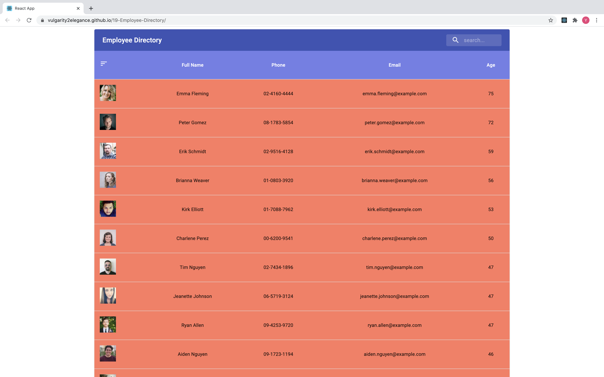

# 19-Employee-Directory


## Description


This project features an app that displays an employee directory built by React, modulariizing application's UI into components, manage component state, and respond to user events.

## Table of Contents

- [Installation](#Installation)
- [Usage](#Usage)
- [License](#License)
- [Questions](#Questions)

## Installation

To install necessary dependencies, run the following command:

```
npm i
```

## Usage

### User Story

- As a user, I want to be able to view my entire employee directory at once so that I have quick access to their information.

### Business Context

An employee or manager would benefit greatly from being able to view non-sensitive data about other employees. It would be particularly helpful to be able to filter employees by name.

### Acceptance Criteria

Given a table of random users, when the user loads the page, a table of employees should render.

The user should be able to:

- Sort the table by at least one category, in this case, Age in a descending order.

- Filter the users by at least one property, in this case, Name.

## License

This project is licensed under the MIT.

## Questions

If you have any questions about the repo, open an issue or contact me directly at jyzhu0101@gmail.com.

You can find more of my work at [Vulgarity2Elegance](https://github.com/Vulgarity2Elegance).
